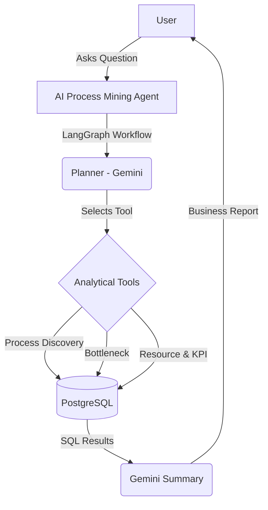

<div align="center">

# 🌊 FlowLens

**AI-Powered Process Mining Platform**

[](https://www.python.org/)
[](https://www.djangoproject.com/)
[](https://www.postgresql.org/)
[](https://python.langchain.com/docs/langgraph)
[](https://deepmind.google/technologies/gemini/)

*Discover workflows, identify bottlenecks, detect SLA violations, and evaluate performance using natural language.*

</div>

---

## 📖 Overview

**FlowLens** transforms how organizations understand their business processes. Instead of manually writing complex SQL queries or staring at static dashboards, managers can simply ask questions in natural language:

> 💬 *"Why are my orders delayed?"*  
> 💬 *"Which team is causing the delays?"*  
> 💬 *"Show the KPI summary."*  
> 💬 *"Which process has the most SLA violations?"*

FlowLens automatically selects the right analytical tools, executes advanced SQL queries on event logs, and generates a business-friendly report with actionable recommendations using **Google Gemini** and **LangGraph**.

---

## ⚡ Key Features

- **🗣️ Natural Language Interface**: Chat with your event data using AI.
- **🔍 Process Discovery**: Automatically reconstruct full workflows from event logs.
- **⏳ Bottleneck Analysis**: Instantly locate delays and wait times.
- **🔄 Variant Analysis**: Identify the different paths business processes take.
- **👥 Resource Analytics**: Measure employee and team performance.
- **⚠️ SLA Detection**: Automatically flag and report SLA violations.
- **📊 KPI Dashboard**: Get a summary of your critical metrics.

---

## 🏗️ Architecture



---

## 🛠️ Tech Stack

### **Backend**
*   **Python, Django, Django REST Framework**: Robust, scalable API backend.
*   **PostgreSQL**: Powers advanced SQL analytics (Window Functions, CTEs, LEAD/LAG).

### **AI & Agents**
*   **Google Gemini**: The reasoning engine for interpreting queries and generating reports.
*   **LangGraph**: Modular AI agent workflow manager (Planner → Tool → Summary).

---

## 🗄️ Database Design

FlowLens uses structured event data to reconstruct processes.

*   **📦 Orders**: `Order ID, Customer, Status, Created Time`
*   **🏃 Activities**: Every step in the process (e.g., `Order Placed`, `Payment Verification`, `Shipped`)
*   **👷 Resources**: Employees, teams, warehouses (e.g., `Team A`, `BlueDart`)
*   **📜 Event Log**: The heart of the system—recording every step, timestamp, and resource for each order.

---

## 🚀 Getting Started

### 1. Clone the repository
```bash
git clone https://github.com/KISHOR-glitch/FlowLens.git
cd FlowLens
```

### 2. Set up Virtual Environment & Install Dependencies
```bash
python -m venv venv
source venv/bin/activate  # On Windows use: venv\Scripts\activate
pip install -r requirements.txt
```

### 3. Configure Database (.env)
Update your `.env` file with PostgreSQL and Gemini credentials:
```env
DB_NAME=flowlens
DB_USER=postgres
DB_PASSWORD=yourpassword
DB_HOST=localhost
DB_PORT=5432

GEMINI_API_KEY=your_gemini_api_key
```

### 4. Generate Mock Data
Need data to play with? We have a script for that:
```bash
python data/generate_data.py
```
*(Requires `faker` and `pandas`)*

### 5. Run Migrations & Start Server
```bash
python manage.py migrate
python manage.py runserver
```

---

## 🔮 Future Roadmap

- [ ] **Interactive Frontend**: Streamlit or React-based dashboard.
- [ ] **Real-time Streaming**: Integrate with Apache Kafka.
- [ ] **Predictive Analytics**: Machine learning models to foresee bottlenecks.
- [ ] **Enterprise Integrations**: Connect with SAP, Oracle, or Salesforce.

---

<div align="center">
Made with ❤️ by the FlowLens Team.
</div>
